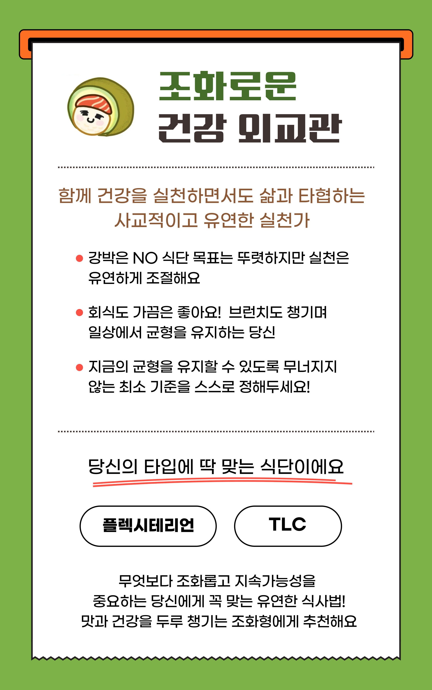
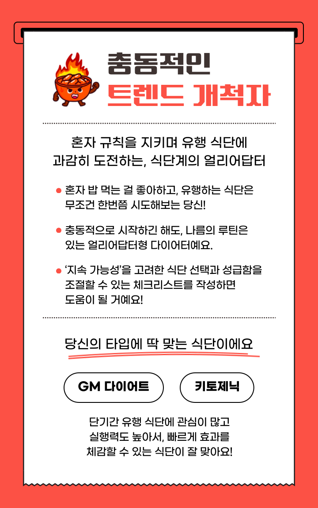

# 🍽️ Americano: 맞춤형 다이어트 플래너


## 프로젝트 소개

**Americano**는 사용자의 식습관, 라이프스타일, 건강 목표에 맞는 다양한 다이어트 플랜을 쉽고 재미있게 탐색할 수 있도록 도와주는 웹 서비스입니다.  
누구나 자신의 성향에 맞는 다이어트 방법을 찾고, 비교하고, 이해할 수 있도록 직관적인 UI와 풍부한 시각 자료를 제공합니다.

---

## 주요 기능

- **다이어트 플랜 소개**  
  저탄수화물, 시간제한식, 건강중심, 플렉시테리언 등 다양한 다이어트 플랜의 특징과 장단점을 한눈에 볼 수 있습니다.

- **맞춤형 다이어트 테스트**  
  간단한 테스트를 통해 나에게 맞는 다이어트 유형을 추천받을 수 있습니다.

- **다이어트 성향 레이더 차트**  
  테스트 결과를 바탕으로 나의 다이어트 성향을 시각적으로 확인할 수 있습니다.

- **다이어트 등급 및 결과 안내**  
  각 플랜별로 등급과 결과 이미지를 제공하여, 자신의 선택을 쉽게 이해할 수 있습니다.

- **다양한 인포그래픽과 이미지**  
  직관적이고 재미있는 이미지, 배너, 인포그래픽을 통해 다이어트 정보를 쉽고 즐겁게 전달합니다.

---

## 예시 화면

|  |  |
| --------------------------------------------------------------------------------------- | --------------------------------------------------------------------------------------- |

## 기술 스택

- **React** + **Vite** 기반의 빠르고 효율적인 프론트엔드 개발
- **SCSS**를 활용한 커스텀 스타일링
- **React Router**를 통한 SPA 구조

---

## 시작하기

1. 저장소를 클론합니다.
2. 의존성을 설치합니다.
   ```
   npm install
   ```
3. 개발 서버를 실행합니다.
   ```
   npm run dev
   ```
